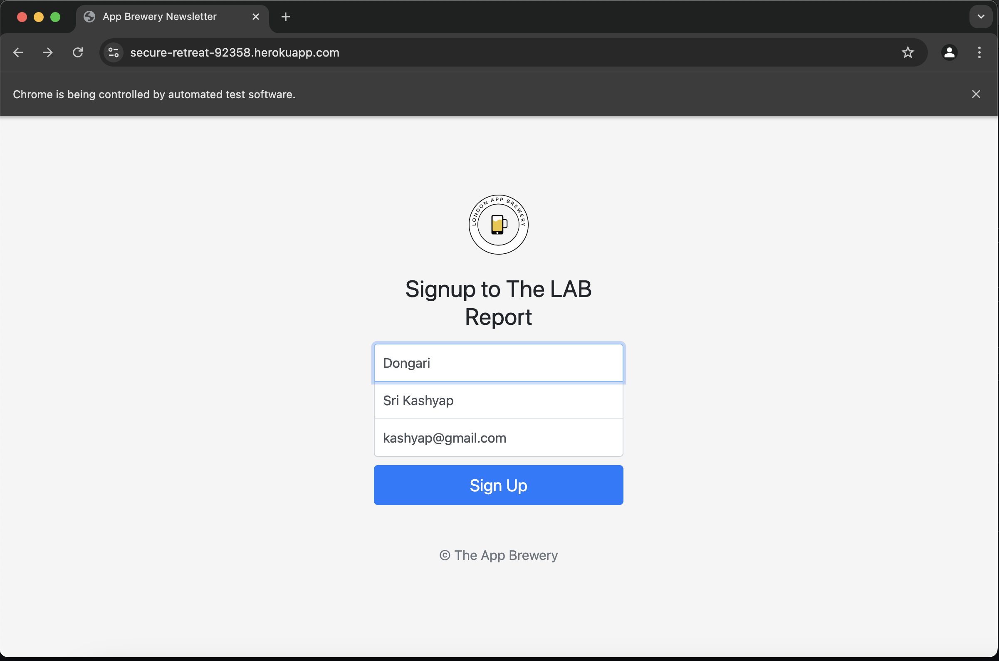
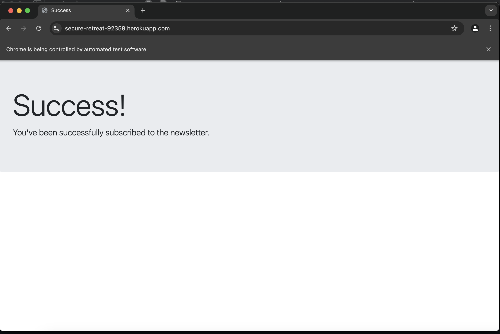

# 📬 Automated-Newsletter-Sign-Up-Bot

This project demonstrates a simple automation script using Selenium in Python to fill out and submit a newsletter sign-up form. The script navigates to a hosted form and auto-fills the first name, last name, and email fields before submitting them—simulating a user sign-up process.

## 🚀 Features

- Automatically launches Chrome browser
- Navigates to the sign-up page
- Fills in the:
  - First name
  - Last name
  - Email
- Submits the form
- Demonstrates basic web automation using Selenium

## 🧰 Tech Stack

- Python 🐍
- Selenium 🔍
- Chrome WebDriver 🌐

## 📸 Screenshots

1. **Auto-filled Sign-Up Page**
   

2. **Confirmation Page After Successful Submission**
   
